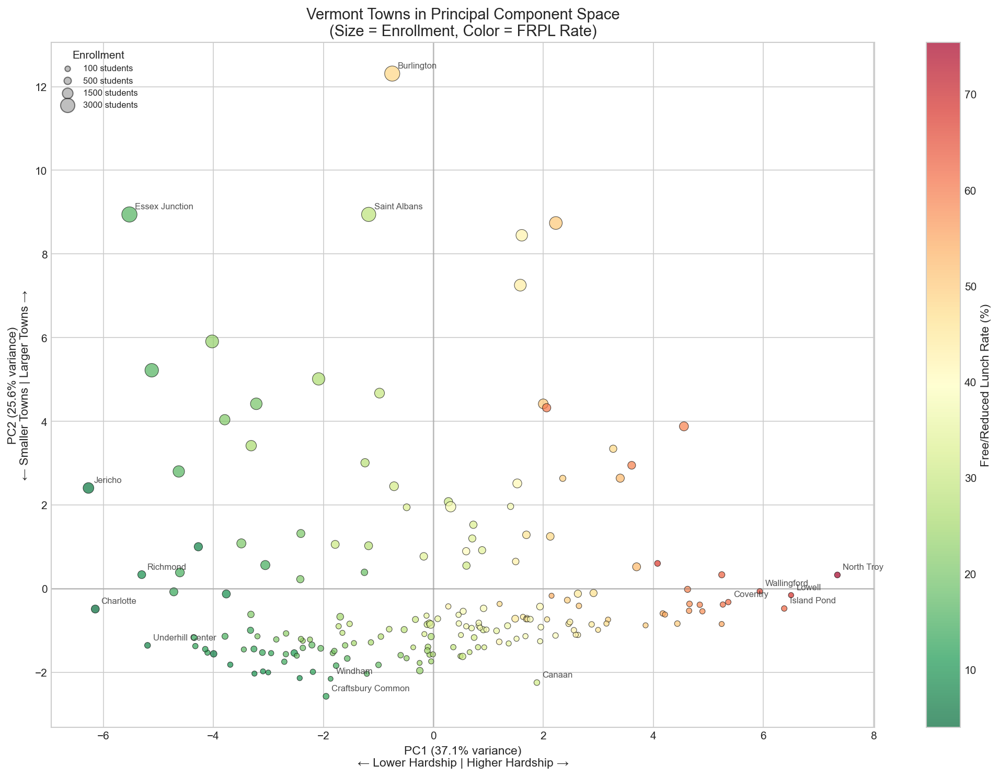
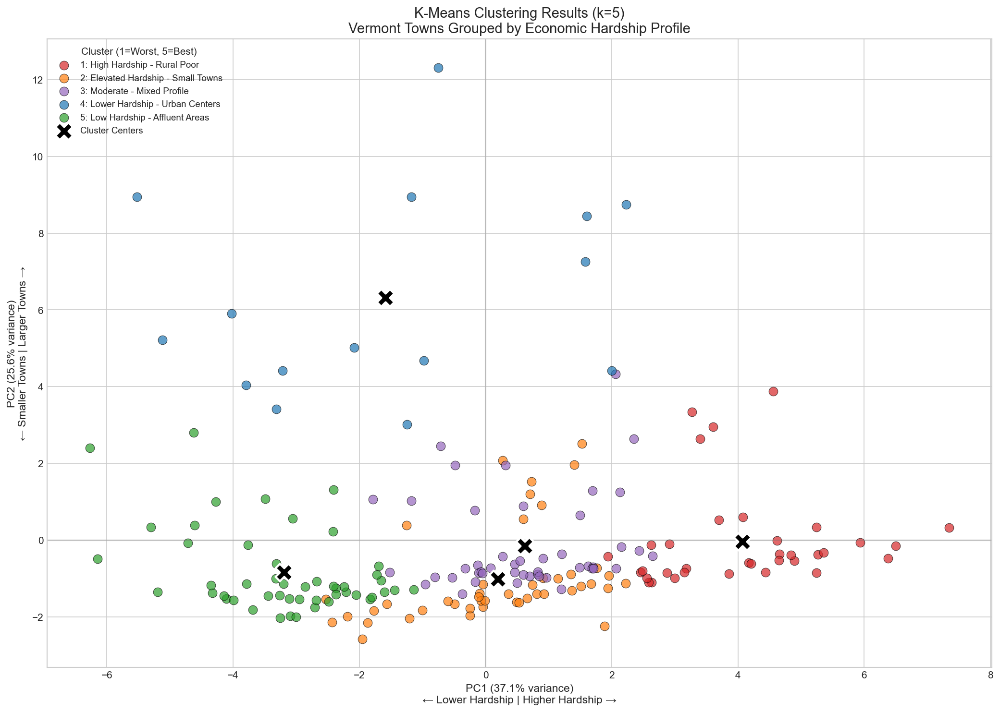
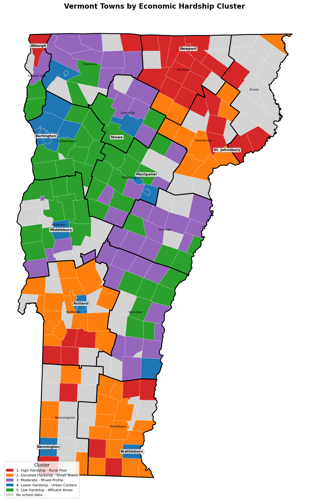

# Vermont Economic Hardship Analysis

I wanted to understand which Vermont towns are struggling the most economically — and whether there are any "hidden" communities that might be overlooked. Using public data from the Census Bureau and school lunch eligibility records, I analyzed all 191 towns in Vermont using unsupervised learning techniques.

The data comes from Census ACS 2022 (county poverty, income, SNAP rates) and NCES Common Core 2022 (school-level free/reduced lunch eligibility). I built a 32-feature matrix for each town, ran PCA to find the main patterns, used K-Means to group similar towns, and then applied anomaly detection to find the outliers.

---

## PCA Results

I reduced the 32 features down to 5 principal components that explain 84% of the variance.

- **PC1 (37%)**: This is basically the "hardship axis" — towns on the right are struggling more
- **PC2 (26%)**: This captures town size — bigger towns at the top, small rural ones at the bottom

---

## K-Means Clustering

I grouped the towns into 5 clusters, ordered from most to least hardship:

| Cluster | Name | Towns | Avg FRPL |
|---------|------|-------|----------|
| 1 (Red) | High Hardship - Rural Poor | 35 | 54% |
| 2 (Orange) | Elevated Hardship | 45 | 28% |
| 3 (Purple) | Moderate | 47 | 39% |
| 4 (Blue) | Urban Centers | 15 | 31% |
| 5 (Green) | Affluent Areas | 49 | 17% |

---

## Geographic Distribution

The Northeast Kingdom (Orleans, Essex, Caledonia counties) is mostly red and orange — that's where hardship is concentrated. Chittenden County around Burlington is mostly green, which makes sense since it's the economic center of the state.

---

## Anomaly Detection

This is the part I found most interesting! I used Isolation Forest to find towns that don't fit the usual patterns. Two stood out:

- **Alburgh** (Grand Isle County): 67.5% FRPL in one of Vermont's wealthiest counties. This is a struggling community that might get overlooked because the county-level stats look fine.

- **Newport** (Orleans County): 59% FRPL with huge variation between schools — one school is at 53% while another is at 71%. That's a 17 percentage point gap, and the variance is nearly 3x the state average. Some kids in town are in much tougher situations than others.

